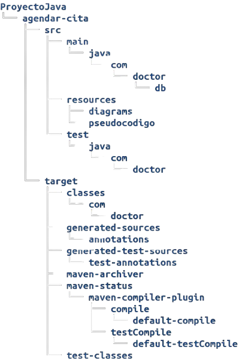
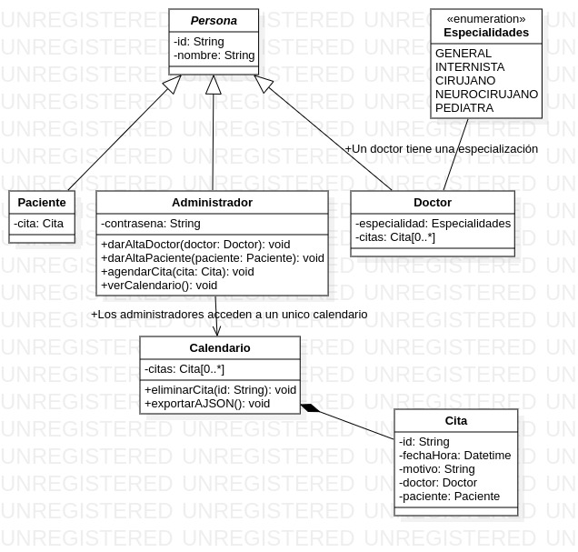
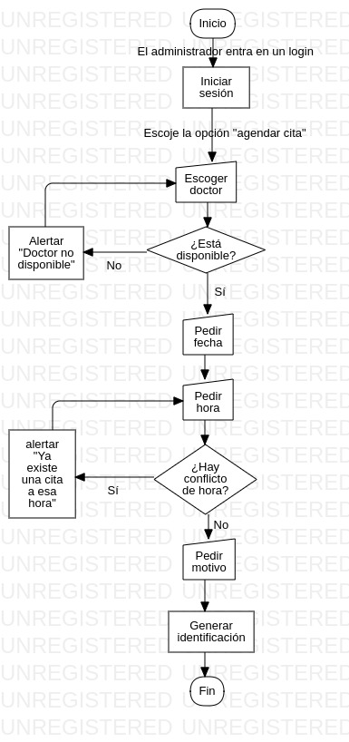

# Proyecto de Java:

## Instalación y configuración.

### Requisitos:
- Java 18 o posterior
- IntelliJ IDEA (Community o el de paga)
- Maven

### Instalación:
1. Clonar este repositorio mediante el comando:

```bash
git clone https://github.com/KevinLealTorres/ProyectoJava.git
```

2. Abrir IntelliJ IDEA

3. Elegir la opción "abrir..." u "open..."

4. Seleccionar la carpeta del proyecto


### Configuración:
1. Refrescar las dependencias para que se importen de Maven Central
2. Construir el proyecto
3. Ejecutar el punto de entrada: Main.main

## estructura del proyecto.

Los archivos y carpetas que viene por defecto de IntelliJ no serán nombrados, sino solamente lo que sirven para
la evidencia:

### Arbol de directorios:


### pseudocódigo:
Esta carpeta contiene todas clases, interfaces y el punto de entrada para que funcione el proyecto, todo está
en .txt, los archivos son:

| Clase               | Observación      |
|---------------------|------------------|
| Administrador.txt   |                  |
| Calendario.txt      |                  |
| Cita.txt            |                  |
| Doctor.txt          |                  |
| Especialidad.txt    | Interfaz         |
| Main.txt            | Punto de entrada |
| Paciente.txt        |                  |

### diagrams:
Aquí están los diagramas y el editable en StarUML para el diseño del programa

Los diagramas son estos:







## Créditos

Programador Java: Kevin Alejandro Leal Torres

Apoyo moral: Kevin Alejandro Leal Torres

Apoyo musical (escuchar su música mientras codificaba): Alfredo Olivas

Ingeniero en requerimientos: Kevin Alejandro Leal Torres

## Licencia.

Licencia MIT: [Licencia de este proyecto](./LICENSE)
